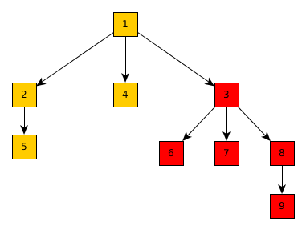

# Kappa\DoctrineMPTT

[](https://travis-ci.org/Kappa-org/DoctrineMPTT)

Modified Pre-order Tree Traversal doctrine implementation.

[http://www.sitepoint.com/series/storing-hierarchical-data-in-a-database/](http://www.sitepoint.com/series/storing-hierarchical-data-in-a-database/)

## Requirements

Full list of dependencies you can get from [Composer config file](https://github.com/Kappa-org/DoctrineMPTT/blob/master/composer.json)

## Installation

The best way to install Kappa\DoctrineMPTT is using [Composer](https://getcomposer.org)

```shell
$ composer require kappa/doctrine-mptt:@dev
```

and register extension

```yaml
extensions:
    doctrine: Kappa\Doctrine\DI\DoctrineExtension
    doctrineMPTT: Kappa\DoctrineMPTT\DI\DoctrineMPTTExtension
```

## Benefits

1. Minimize count of queries. For delete is needed 3 queries (1x `DELETE`, 2x `UPDATE`), for 
create is needed 3 queries (1x `INSERT`, 2x `UPDATE`) and for move item is needed **only 1x `UPDATE`
query**. This algorithm is much faster and more fuel efficient than other commonly used methods, such as
classical parent - children method.
2. Full control over the nesting depth or count of branches

## Restrictions and warnings

1. This package was be tested on MySQL, SQLite and PostgreSQL and it is compatible with them
2. Because this package is working directly with database to minimize count of queries after use 
`moveItem()` or `insertItem()` you should refresh loaded entities. **Attention! you must save all
updates before call this methods to avoids conflicts**

## Configuration

You can set custom names for used columns:

```yaml
doctrineMPTT:
        entityClass: Your\entity
		originalLeftName: _lft
		leftColumnName: lft
		rightColumnName: rgt
		depthColumnName: depth
```

Configuration may not be in config file but can be set `Kappa\DoctrineMPTT\TraversableManager::setConfigurator`.

## Usages

Package provide main `Kappa\DoctrineMPTT\TraversableManager` which can be used for all manipulations.
All operations are performed over entity which is instance of `Kappa\DoctrineMPTT\Entities\TraversableInterface`.


### Entity

You can use own entity but, your entity must implement `Kappa\DoctrineMPTT\Entities\TraversableInterface` interface.
For easier implementation you can use `Kappa\DoctrineMPTT\Entities\Traversable` trait which implements all
requires methods and columns.

### Manager

Original tree structure


`Kappa\DoctrineMPTT\TraversableManager` provides three methods by which we can do all operations.

#### Insert item

`insertItem(TraversableInterface $actual, TraversableInterface $parent = null, $refresh)`

Second argument is new parent and actual item (first argument) will be included under this parent item. 
Last argument is bool and if is set to `true` entities will be refreshed. For example: This code generate 
next tree

```php
$parent = $this->repository->find(4);
$actual = new TraversableEntity();
// ....
$this->traversableManager->insertItem($parent, $actual);
```


If is parent null, actual item will be inserted as last child of root element if it exist. If not exist root
element actual item will be inserted as root. 

#### Move item

`moveItem(TraversableInterface $actual, TraversableInterface $related, action, refresh)` 

With this method you can move each item into new place (as predecessor or descendant). 
Last argument is bool and if is set to `true` entities will be refreshed.
For example **predecessor**

```php
// (1)
$actual = $this->repository->find(3);
$related = $this->repository->find(2);
$this->traversableManager->moveItem($actual, $related, TraversableManager::PREDECESSOR); // (1) - move actual before related

// (2)
$actual = $this->repository->find(3);
$related = $this->repository->find(4);
$this->traversableManager->moveItem($actual, $related, TraversableManager::DESCENDANT); // (2) - move actual as child of related

// (3)
$actual = $this->repository->find(3);
$this->traversableManager->moveItem($actual, null, TraversableManager::DESCENDANT); // (3) - move actual as last child of root
```

**(1) Result**


**(2) Result**


**(3) Result**



#### Remove item

`removeItem(TraversableInterface $actual)` 

Remove item and all its children
For example:

```php
$actual = $this->repository->find(2);
$this->traversableManager->removeItem($actual);
```


### Queries

1. `Kappa\DoctrineMPTT\Queries\Objects\Selectors\GetAll` - returns all items sorted for scalable listing
2. `Kappa\DoctrineMPTT\Queries\Objects\Selectors\GetParents` - returns all parents for actual item
3. `Kappa\DoctrineMPTT\Queries\Objects\Selectors\GetChildren` - returns all children for actual item
4. `Kappa\DoctrineMPTT\Queries\Objects\Selectors\GetPrevious` - return previous item
5. `Kappa\DoctrineMPTT\Queries\Objects\Selectors\GetNext` - return next item
6. `Kappa\DoctrineMPTT\Queries\Objects\Selectors\GetParent` - returns parent item
7. `Kappa\DoctrineMPTT\Queries\Objects\Selectors\GetRoot` - returns tree root

You can use `Kappa\DoctrineMPTT\Queries\SelectorsCollector` as easier getter of query objects
